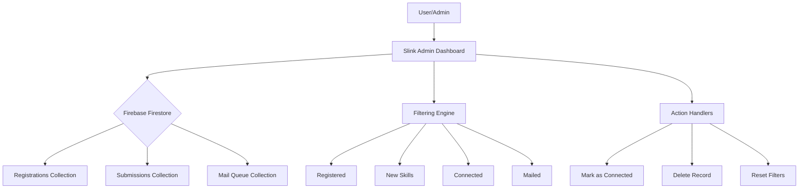

# Slink Admin Dashboard

A real-time administrative dashboard for managing the **Slink** skill-sharing platform. Built with a modern, responsive UI and powered by **Firebase Firestore**.

## 🚀 Overview

Slink Admin provides a centralized interface to monitor registrations, track skill test readiness, and manage connections between learners and tutors. It includes automated assessment pipelines and real-time data synchronization.

## ✨ Features

- **Real-time Dashboard**: Live updates of registrations and skill submissions via Firestore.
- **Intelligent Filtering**: Filter candidates by status (New Skill, Pending, Connected, Mailed).
- **Skill Test Tracking**: Monitor "Readiness" scores and "Ready to teach" status for candidates.
- **Mail Queue Management**: Track candidates in the automated assessment pipeline.
- **Detailed Profiles**: View candidate contact info, resume status, and suggested tutors based on skill matching.
- **Data Deletion**: Secure deletion of registrations with name-match confirmation.
- **Responsive Design**: Mobile-friendly interface with an Athena-inspired sidebar and adaptive data tables.

## 🛠️ Tech Stack

- **Frontend**: HTML5, Tailwind CSS (via CDN)
- **Icons & Fonts**: Lucide/SVG Icons, Inter Font (Google Fonts)
- **Backend**: Firebase Firestore, Firebase Analytics
- **Data Synchronization**: Firebase JS SDK (v10.8.1)

## 🏗️ Architecture & Logic



## ⚙️ Setup & Configuration

1. **Firebase Setup**:
   The application uses a specific Firebase project. The configuration is hardcoded in the `index.html` file (for development/admin use):
   ```javascript
   const firebaseConfig = {
     apiKey: "...",
     authDomain: "slink-website.firebaseapp.com",
     projectId: "slink-website",
     // ...
   };
   ```

2. **Deployment**:
   Since this is a single-page HTML app, it can be hosted on:
   - Firebase Hosting
   - Netlify / Vercel
   - GitHub Pages

3. **Local Development**:
   Simply open `index.html` in a modern web browser. No build step is required as Tailwind and Firebase are loaded via CDN.

## 📁 Project Structure

- `index.html`: The main single-page application containing all logic, styles, and markup.
- `img/`: Directory for project assets (e.g., `slink.png`).

---

*Note: This dashboard is designed for administrative use and requires access to the `slink-website` Firebase project.*
